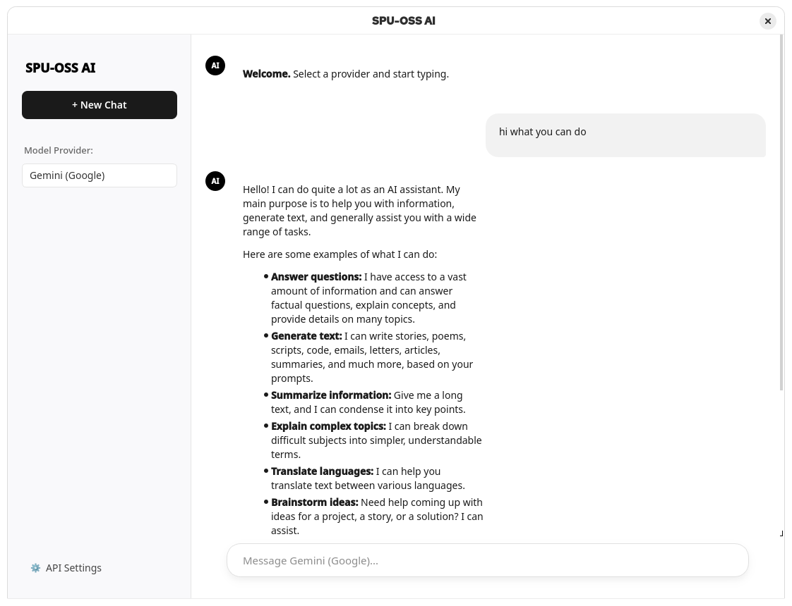
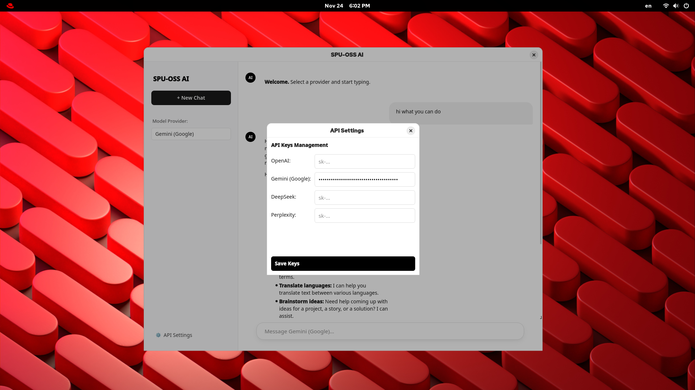
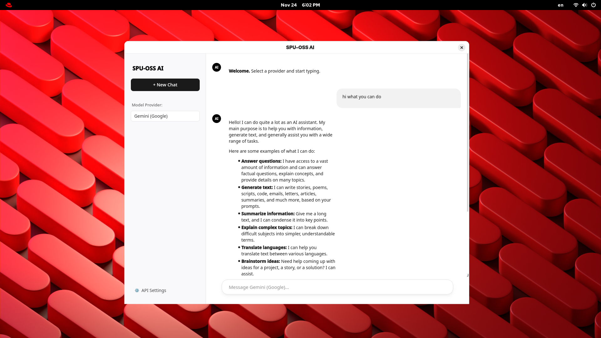

SPU-OSS AI (Minimal Edition)
============================

**SPU-OSS AI** คือโปรแกรม Desktop Application สำหรับการสนทนากับปัญญาประดิษฐ์ (AI) ที่ได้รับการออกแบบใหม่ภายใต้ปรัชญา **"Minimalism"** เน้นความเรียบง่าย สะอาดตา และลดสิ่งรบกวนทางสายตา เพื่อให้ผู้ใช้งานสามารถจดจ่อกับเนื้อหาการสนทนาได้อย่างเต็มที่ รองรับการเชื่อมต่อกับผู้ให้บริการ AI ชั้นนำหลากหลายค่าย

📸 ภาพตัวอย่างแอปพลิเคชัน (Screenshots)
---------------------------------------

### 1\. หน้าจอหลักและการออกแบบ (Main Interface)

การจัดวางองค์ประกอบที่เน้นความสบายตา พร้อม Sidebar ด้านซ้ายสำหรับจัดการเมนู
\
\

### 2\. การรองรับ Markdown และ Code Block

แสดงผลโค้ดและการจัดรูปแบบข้อความได้อย่างสวยงามและอ่านง่าย

### 3\. การตั้งค่า API Key (Settings)

ระบบจัดการ API Key ที่ปลอดภัย โดยบันทึกข้อมูลไว้ภายในเครื่องของผู้ใช้ (Local Storage)

✨ คุณสมบัติเด่น (Key Features)
------------------------------

-   **User Interface ที่ทันสมัย**: ออกแบบโดยอ้างอิงหลักการ UX/UI ของ macOS และแอปพลิเคชันยุคใหม่ (Modern Minimalist)

-   **รองรับ Multi-Provider**: สามารถสลับใช้งานระหว่างโมเดล AI ต่างๆ ได้ทันทีโดยไม่ต้องเริ่มโปรแกรมใหม่

    -   🟢 **OpenAI** (GPT-4o, GPT-3.5)

    -   🔵 **Google Gemini** (Flash 1.5)

    -   🟣 **DeepSeek** (DeepSeek Chat)

    -   🟠 **Perplexity** (Sonar/Llama 3.1)

-   **Markdown Support**: รองรับการแสดงผลทางคณิตศาสตร์, ตาราง, และ Code Syntax Highlighting

-   **Privacy Focused**: ข้อมูล API Key จะถูกเข้ารหัสและจัดเก็บอยู่ภายในเครื่องของคุณเท่านั้น ไม่มีการส่งข้อมูลผ่านเซิร์ฟเวอร์กลาง

🛠️ การติดตั้งและการใช้งาน (Installation)
-----------------------------------------

เพื่อให้มั่นใจว่าโปรแกรมจะทำงานได้อย่างสมบูรณ์ กรุณาปฏิบัติตามขั้นตอนดังนี้:

### 1\. ติดตั้งไลบรารีที่จำเป็น

โปรแกรมนี้พัฒนาด้วย Python จำเป็นต้องติดตั้งชุดคำสั่งพื้นฐานก่อนเริ่มใช้งาน

```
pip install PyQt6 requests markdown

```

### 2\. การเรียกใช้งานโปรแกรม

เปิด Terminal หรือ Command Prompt ในโฟลเดอร์ที่เก็บไฟล์ และใช้คำสั่ง:

```
python main.py

```

*(หรือ `python3 main.py` สำหรับ macOS/Linux)*

⚙️ การตั้งค่าเริ่มต้น (Configuration)
-------------------------------------

เมื่อเปิดใช้งานครั้งแรก จำเป็นต้องตั้งค่าการเชื่อมต่อ (API Key) ดังนี้:

1.  คลิกที่ปุ่ม **"⚙️ API Settings"** บริเวณมุมซ้ายล่างของแถบเมนู

2.  นำ **API Key** จากผู้ให้บริการที่คุณต้องการใช้งานมาวางในช่องที่กำหนด

    -   *OpenAI Key* สำหรับใช้งาน GPT

    -   *Google Gemini Key* สำหรับใช้งาน Gemini

3.  กดปุ่ม **Save Keys** เพื่อบันทึก

4.  เลือกโมเดลที่ต้องการใช้งานจากเมนู **Model Provider** ด้านซ้ายมือ

📋 ข้อกำหนดทางเทคนิค (Technical Requirements)
---------------------------------------------

-   **Operating System**: Windows 10/11, macOS, หรือ Linux

-   **Python Version**: 3.8 หรือสูงกว่า

-   **Display Resolution**: แนะนำความละเอียด 1280x720 ขึ้นไป

> **หมายเหตุ:** โปรแกรมนี้เป็นซอฟต์แวร์ Open Source เพื่อการศึกษาและการใช้งานส่วนบุคคล การใช้งาน API ของแต่ละค่ายอาจมีค่าใช้จ่ายขึ้นอยู่กับผู้ให้บริการนั้นๆ
